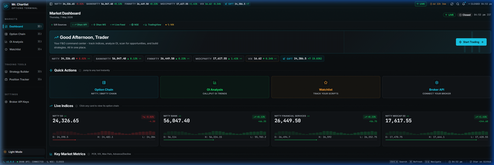
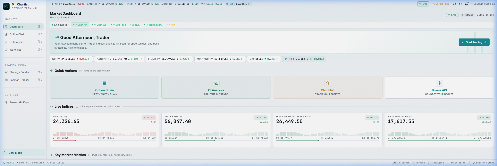
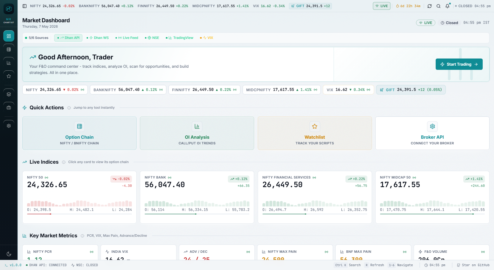
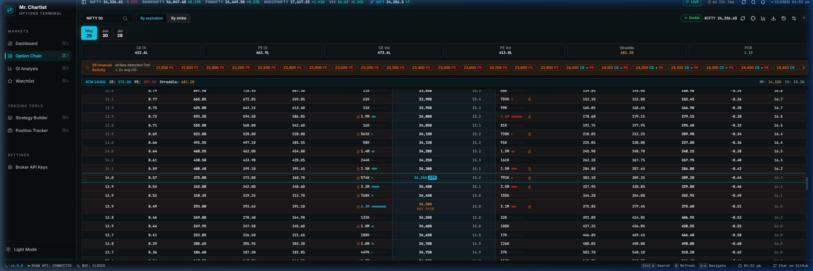
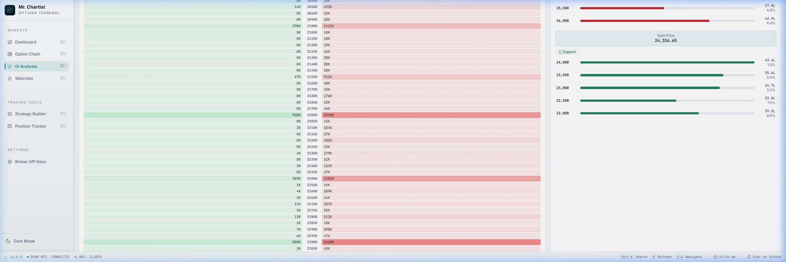
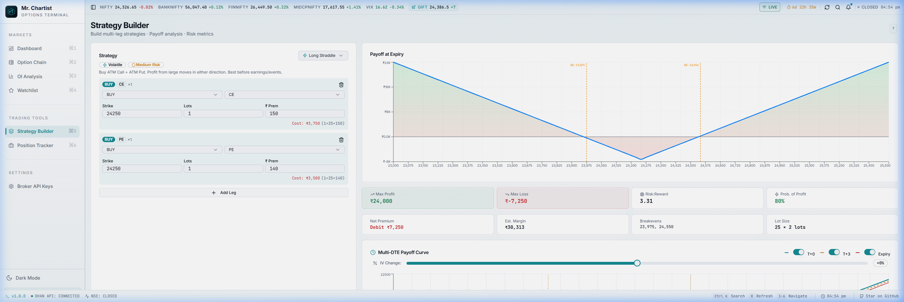
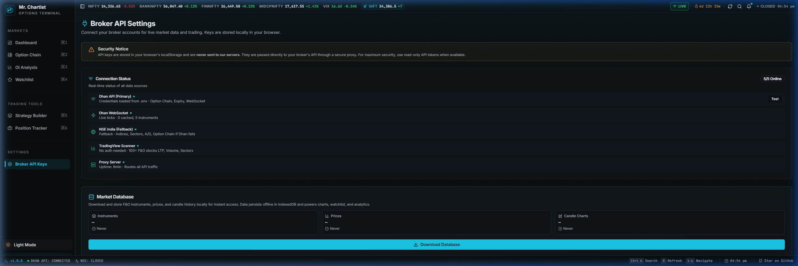
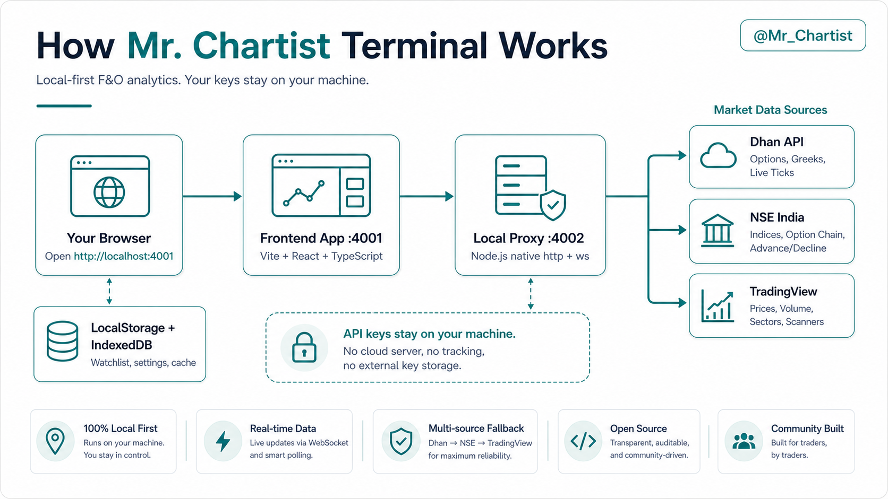

<div align="center">

**India's most comprehensive open-source Options & Futures analytics terminal.**

Built for NSE F&O traders who want a polished, institutional-style terminal — free, open-source, and running in your browser.

[](https://react.dev)
[](https://typescriptlang.org)
[](https://vitejs.dev)
[](https://tailwindcss.com)
[](LICENSE)
[](CONTRIBUTING.md)

[Preview](#preview) · [Quick Start](#-quick-start-5-minutes) · [Features](#-what-you-get) · [ORB Strategy](#orb-opening-range-breakout-strategy) · [Data Sources](#-data-sources) · [Contributing](#-contributing)

</div>

---

> **🚀 v1.0 — Actively Maintained**
>
> Core features are stable and production-ready. Includes a full ORB (Opening Range Breakout) strategy engine with paper trading, Trade Journal, simulation widget, and live intraday charts. Runs locally on your machine — no cloud, no subscription required.
>
> **Fork it, build on it, make it yours!** MIT licensed.

---

## Preview

<details open>
<summary><strong>🌙 Dark Mode — Market Dashboard</strong></summary>



</details>

<details>
<summary><strong>☀️ Light Mode — Dashboard</strong></summary>



</details>

<details>
<summary><strong>Polished Compact Navigation</strong></summary>



</details>

<details>
<summary><strong>🌙 Dark Mode — Option Chain</strong></summary>



</details>

<details>
<summary><strong>☀️ Light Mode — OI Analysis</strong></summary>



</details>

<details>
<summary><strong>☀️ Light Mode — Strategy Builder</strong></summary>



</details>

<details>
<summary><strong>🌙 Dark Mode — Broker Settings</strong></summary>



</details>

---

## 🧠 What Is This?

A **free, browser-based Options & Futures analytics terminal** for the Indian stock market (NSE).

Think of it as your personal trading dashboard that shows live prices, full option chains, OI analysis, an ORB strategy engine with paper trading, a Trade Journal, payoff diagram builder, and much more — all running locally with zero cloud dependency.

**Who is this for?**
- 📈 **Options traders** who want professional tools without paying ₹2,000+/month
- 🎯 **ORB traders** who want a structured breakout strategy with automated signal detection, simulation, and journaling
- 🎓 **Beginners** learning about option chains, OI analysis, and Greeks
- 💻 **Developers** who want to build on top of a solid F&O analytics platform

---

## Start Here (No Coding Experience Needed)

You only need three things: **Node.js**, this project folder, and a browser. The app runs entirely on your own computer.

### Windows

1. Install **Node.js LTS** from [nodejs.org](https://nodejs.org/)
2. Download this project as a ZIP from GitHub and extract it
3. Open the project folder, click the address bar, type `cmd`, and press **Enter**
4. Run `npm install`
5. Run `npm run dev`
6. Open `http://localhost:4001` in Chrome, Edge, or Brave

### Mac

1. Install **Node.js LTS** from [nodejs.org](https://nodejs.org/)
2. Download or clone this repo
3. Open **Terminal**, drag the project folder into it, and press **Enter**
4. Run `npm install`
5. Run `npm run dev`
6. Open `http://localhost:4001` in any browser

Keep the terminal window open while using the dashboard. Press `Ctrl+C` to stop.

---

## ✨ What You Get

| Feature | What It Does | Status |
|---------|-------------|--------|
| **📊 Live Dashboard** | NIFTY, BANKNIFTY, VIX, sector heatmap, PCR, Max Pain, market breadth score | ✅ Working |
| **⛓️ Option Chain** | Full strike-wise LTP, OI, OI Change, Volume, IV for any F&O symbol | ✅ Working |
| **📈 OI Analysis** | ATM zone, OI heatmap, support/resistance, IV/PCR modules, 10 analysis tabs | ✅ Working |
| **🎯 ORB Strategy** | Opening Range Breakout engine with signals, paper trading, simulation, and charts | ✅ Working |
| **📓 Trade Journal** | IndexedDB-backed journal for every paper trade — P&L, charts, notes, ratings | ✅ Working |
| **🧮 Strategy Builder** | Build Bull Call Spread, Iron Condor, Straddle — see payoff chart before trading | ✅ Working |
| **💼 Position Tracker** | Track open positions with real-time P&L | ✅ Working |
| **⭐ Watchlist** | Save favorite stocks for quick access | ✅ Working |
| **🔑 Broker Settings** | Connect Dhan/Zerodha/Angel One for live data (BYOK) | ✅ Dhan fully connected |
| **📡 WebSocket Feed** | Real-time price ticks via Dhan WebSocket binary protocol | ✅ Working |
| **📥 Chart Downloader** | Batch download OHLCV candles via Yahoo Finance (no API key) | ✅ Working |

---

## 🎯 ORB (Opening Range Breakout) Strategy

The ORB module is the most advanced feature of this terminal. It monitors the 9:15–9:30 AM IST opening range, detects breakouts, manages a full trade lifecycle, and logs everything to your local Trade Journal.

### How It Works

**Opening Range** — The high and low of the first 15 minutes (9:15–9:30 AM IST) form the ORB range.

**Entry Rules:**
- Bullish: 5-min candle closes above ORB High (green candle) + EMA9 momentum gate
- Bearish: 5-min candle closes below ORB Low (red candle) + EMA9 momentum gate
- Entry price = ORB High (bullish) / ORB Low (bearish) — not the candle close

**Trade Lifecycle:**
| Level | Trigger | Action |
|-------|---------|--------|
| **Entry** | ORB High/Low breakout | Enter at breakout level |
| **SL** | ORB Low (bullish) / ORB High (bearish) | Structural stop at ORB boundary |
| **TP1** (1R) | Price reaches Entry + 1×risk | SL moves to entry (cost-to-cost) |
| **TP2** (2R) | Price reaches Entry + 2×risk | Book 50% of position |
| **EMA9 Trail** | After TP2 | Remaining 50% trails EMA9 until stopped out |
| **Re-entry** | Max 1 re-entry after SL hit | Only if price breaks ORB High again (same direction) |

**Chart markers** distinguish every event: BO ▲ (breakout), T1 (green circle), T2 (purple circle), RE ▲ (re-entry), SL ✕ (stop hit).

### Paper Trading

Click **Add Trade** on any watchlist stock to open a paper trade. The system automatically:
- Moves SL to entry when TP1 is hit
- Books 50% partial exit at TP2
- Trails the remaining position with EMA9

Each trade is persisted to IndexedDB and shows up in the Trade Journal with a full intraday chart.

### Today's Simulation

The **Today's Simulation** widget (bottom of the ORB page) runs the ORB strategy on all stocks from the 9:30 AM snapshot and shows what would have happened if every signal was traded — P&L, entry/exit times, partial bookings, and a chart for each result.

### Sector & Watchlist Engine

The watchlist is snapshot-based — it captures the market state at 9:30 AM and uses that for the ORB calculation. This avoids false signals from late movers and keeps the ORB bias consistent throughout the day.

- **Snapshot bias** = F&O advance/decline ratio at 9:30 AM
- **Sector rotation** = Live advance/decline for intraday sector plays
- **EMA9 gate** = Momentum confirmation before entry

---

## 🚀 Quick Start (5 Minutes)

### Prerequisites

| Tool | Version | Download |
|------|---------|----------|
| **Node.js** | v18 or higher | [nodejs.org](https://nodejs.org/) |
| **Git** | Any recent | [git-scm.com](https://git-scm.com/downloads) |
| **Code Editor** | Optional | [VS Code](https://code.visualstudio.com/) |

### Step 1: Clone the Repository

```bash
git clone https://github.com/YOUR_USERNAME/india-option-hub.git
cd india-option-hub
```

Or download the ZIP from GitHub → Code → Download ZIP.

### Step 2: Install Dependencies

```bash
npm install
```

Wait ~1–2 minutes on first install.

### Step 3: Start the App

```bash
npm run dev
```

This starts two servers:

| Server | URL | Purpose |
|--------|-----|---------|
| **Vite** (frontend) | `http://localhost:4001` | The React app |
| **Proxy** (data relay) | `http://localhost:4002` | Routes Dhan / NSE / TradingView data |

Open `http://localhost:4001` in your browser. During market hours (Mon–Fri, 9:15 AM–3:30 PM IST), live data loads automatically — no API key needed for the basic dashboard.

### What Works Without API Keys

| Works immediately | Needs optional Dhan key |
|-------------------|-------------------------|
| Dashboard, ORB Strategy, option chain fallback, sector heatmap, watchlist, simulation | Full option chain with Greeks, Dhan WebSocket live ticks, ORB live feed |
| Yahoo Finance intraday candle charts (5-min) | Broker-authenticated endpoints |
| All local storage, trade journal, paper trading | Premium real-time data |

### Step 4 (Optional): Add Dhan API for Best Data

1. Create a free account at [dhan.co](https://dhan.co)
2. Get API credentials from [Dhan Developer Portal](https://dhanhq.co/docs/v2/)
3. Copy `.env.example` to `.env`:

```bash
# Mac/Linux
cp .env.example .env

# Windows
copy .env.example .env
```

4. Add your credentials to `.env`:

```env
DHAN_CLIENT_ID=your_client_id_here
DHAN_ACCESS_TOKEN=your_access_token_here
```

5. Restart the app (`Ctrl+C` then `npm run dev`)

You can also enter credentials from the UI at **Broker Settings** — they're stored in localStorage and never leave your machine.

---

## 📡 Data Sources

```
Priority: Dhan API → NSE India → TradingView → Yahoo Finance (charts)
```

| Source | Provides | Auth? | Freshness |
|--------|---------|-------|-----------|
| **Dhan API** ⭐ | Option Chain, Greeks, F&O stock quotes, Live WebSocket ticks | Yes (free key) | Real-time |
| **NSE India** | Indices, sectors, A/D ratio, option chain fallback | No | 3–5 sec delay |
| **TradingView** | 100+ F&O stock prices, volume, sector data | No | 15–30 sec delay |
| **Yahoo Finance** | Historical + intraday OHLCV (5-min candles) for all NSE stocks | No | 15-min delay |

### How Data Flows

```
Your Browser  ←→  Local Proxy Server (:4002)  ←→  Dhan / NSE / TradingView
      ↑                    ↑
      │                    │
   React App          Handles CORS, caching,
   (port 4001)        retry, WebSocket relay
```

1. The browser sends requests to the local proxy on your machine
2. The proxy forwards requests to Dhan/NSE/TradingView with automatic failover
3. Responses are cached (3–30 seconds) to avoid rate limits
4. Dhan WebSocket binary frames are parsed and relayed as clean JSON

> **Security:** Your API keys never leave your machine. The proxy runs 100% locally.

### Data Source Status Bar

The dashboard shows a live 6-indicator status bar at the top:

| Indicator | What It Tracks |
|-----------|----------------|
| 🟢 **Dhan API** | Primary option chain + F&O stock quotes |
| 🟢 **Dhan WS** | WebSocket connected (live ticks) |
| 🟢 **Live Feed** | Browser receiving WebSocket data |
| 🟢 **NSE** | Indices + sector fallback |
| 🟢 **TradingView** | F&O stock scanner |
| 🟢 **VIX** | India VIX |

Hover any indicator for detailed connection info.

---

## 📖 Pages Guide

### 1. Dashboard (`/`, `⌘1`)

10+ live data sections that refresh automatically during market hours.

- **Ticker Tape** — Scrolling prices at the top
- **Index Cards** — NIFTY 50, BANK NIFTY, FINNIFTY, MIDCAP NIFTY with intraday sparklines
- **Key Metrics** — PCR, VIX, Max Pain for NIFTY and BANKNIFTY
- **Expected Move** — How much NIFTY/BANKNIFTY might move before expiry
- **IV Rank Scanner** — Scans major stocks for cheap/expensive options
- **Top Movers** — Biggest F&O gainers and losers
- **Sector Heatmap** — Color-coded money flow across sectors
- **Most Active F&O** — Stocks with highest OI + volume
- **Market Breadth** — Sentiment score, Advance/Decline ratio, VIX regime
- **Futures & VIX** — Futures premium/discount + VIX trend chart

### 2. Option Chain (`/option-chain`, `⌘2`)

Full option chain for any F&O symbol.

- CE/PE LTP, OI, OI Change, Volume, IV for every strike
- ATM strike auto-highlighted
- Switch between expiry dates
- PCR and total OI in header
- Dhan primary, NSE fallback (auto-detected)

### 3. OI Analysis (`/oi-analysis`, `⌘3`)

Deep Open Interest analysis with 10 tabs:

| Tab | Shows |
|-----|-------|
| Delta OI | Directional exposure per strike |
| Strike PCR | Put-Call ratio per strike |
| OI Distribution | Where Call/Put writers are concentrated |
| OI Change | Strike-wise OI change |
| Multi-Expiry | Weekly vs Monthly OI |
| IV Smile | Implied Volatility skew |
| PCR Trend | Live PCR gauge |
| OI Interpretation | Buildup, unwinding, short covering |
| Top Strikes | Highest CE/PE OI strikes |

### 4. Watchlist (`/watchlist`, `⌘4`)

Save and monitor your favorite F&O symbols.

### 5. ORB Strategy (`/orb-strategy`, `⌘5`)

The full Opening Range Breakout workflow in one page:

- **Sector Rotation Panel** — Live sector strength from the 9:30 AM snapshot
- **ORB Watchlist** — Top momentum stocks meeting the ≥2% filter
- **ORB Chart** — 5-min intraday candles with ORB H/L lines, Entry, T1, T2, EMA9, and all event markers
- **Paper Trade Panel** — Open trades with live P&L, SL, partial booking status
- **Today's Simulation** — Runs ORB logic on all 9:30 AM snapshot stocks, shows what each trade would have returned
- **Trade Journal** — Expandable detail chart for any completed trade

**Chart Elements:**
| Element | Description |
|---------|-------------|
| ORB H / ORB L | Purple/red horizontal lines marking the opening range |
| Entry | Violet dashed line at breakout level |
| T1 (green) | 1R target — SL moves to cost when touched |
| T2 (purple) | 2R target — 50% partial exit + EMA9 trail begins |
| EMA9 (amber) | Trailing momentum indicator |
| BO ▲ / BO ▼ | Breakout entry marker |
| T1 ● / T2 ● | Target hit markers |
| SL ✕ | Stop-loss hit marker |
| RE ▲ | Re-entry marker |

### 6. Trade Journal (`/trade-journal`, `⌘6`)

Complete history of all paper trades with:

- Daily grouped view with P&L summary per day
- Full trade cards showing entry/exit prices, SL, T1, T2
- 5-min intraday chart for each trade (today's trades: live; historical: Dhan credentials required)
- Notes, emotion tagging, execution quality rating (1–5 stars), lessons learned
- Export/import trade data

### 7. Strategy Builder (`/strategy-builder`, `⌘7`)

Build any options strategy and see its payoff chart.

Pre-built: Bull Call Spread, Bear Put Spread, Long Straddle, Iron Condor, Butterfly, Collar, and more.

### 8. Position Tracker (`/position-tracker`, `⌘8`)

Track open option positions with simulated P&L.

### 9. Broker Settings (`/broker-settings`)

Configure broker API credentials. Supports 7 Indian brokers:

| Broker | Status |
|--------|--------|
| **Dhan** | ✅ Fully integrated |
| Zerodha, Angel One, Upstox, Fyers, 5paisa, Alice Blue | 🔧 UI ready, backend coming soon |

---

## ⌨️ Keyboard Shortcuts

| Shortcut | Page |
|----------|------|
| `⌘1` / `Ctrl+1` | Dashboard |
| `⌘2` / `Ctrl+2` | Option Chain |
| `⌘3` / `Ctrl+3` | OI Analysis |
| `⌘4` / `Ctrl+4` | Watchlist |
| `⌘5` / `Ctrl+5` | ORB Strategy |
| `⌘6` / `Ctrl+6` | Trade Journal |
| `⌘7` / `Ctrl+7` | Strategy Builder |
| `⌘8` / `Ctrl+8` | Position Tracker |
| `⌘K` / `Ctrl+K` | Command Palette |

---

## 🧱 Tech Stack

| Layer | Technology | Why |
|-------|-----------|-----|
| **Frontend** | React 18 + TypeScript | Type-safe, modern UI |
| **Build Tool** | Vite 5 | Instant hot-reload |
| **Data Fetching** | TanStack React Query | Caching, retry, background refresh |
| **UI Components** | shadcn/ui + Radix | Accessible, themeable components |
| **Styling** | Tailwind CSS 3 | Dark/light theme support |
| **Intraday Charts** | lightweight-charts v5 | High-performance candlestick + price lines |
| **OI/Payoff Charts** | Recharts | Interactive analysis charts |
| **Proxy Server** | Node.js (native http + ws) | Local CORS proxy — no Express, no bloat |
| **WebSocket** | ws (Node.js) | Real-time Dhan binary protocol parsing |
| **Local Storage** | IndexedDB (localDatabase.ts) | Trade history, price snapshots, candle cache |
| **Routing** | React Router v6 | Client-side navigation |

---

## 📁 Project Structure

```
india-option-hub/
├── proxy-server.mjs          # Local proxy (Dhan + NSE + TradingView + WebSocket relay)
├── .env.example              # Environment variable template
├── package.json              # Dependencies and scripts
├── vite.config.ts            # Vite config (port 4001)
│
├── src/
│   ├── App.tsx               # Routes and providers
│   │
│   ├── pages/
│   │   ├── Index.tsx             # Dashboard (/)
│   │   ├── OptionChain.tsx       # Option Chain (/option-chain)
│   │   ├── OIAnalysis.tsx        # OI Analysis (/oi-analysis)
│   │   ├── ORBStrategy.tsx       # ORB Strategy (/orb-strategy) ← main strategy page
│   │   ├── TradeJournal.tsx      # Trade Journal (/trade-journal)
│   │   ├── Watchlist.tsx         # Watchlist (/watchlist)
│   │   ├── StrategyBuilder.tsx   # Strategy Builder (/strategy-builder)
│   │   ├── PositionTracker.tsx   # Position Tracker (/position-tracker)
│   │   └── BrokerSettings.tsx    # Broker Settings (/broker-settings)
│   │
│   ├── components/
│   │   ├── ui/                   # Base components (Button, Card, Table, Badge…)
│   │   ├── dashboard/            # Dashboard section widgets
│   │   │   ├── DataSourcesBar.tsx    # 6-source live status bar
│   │   │   ├── IndexCards.tsx        # NIFTY/BANKNIFTY cards with sparklines
│   │   │   ├── KeyMetrics.tsx        # PCR, VIX, Max Pain
│   │   │   ├── TopMovers.tsx         # Gainers & losers
│   │   │   ├── SectorHeatmap.tsx     # Color-coded sector grid
│   │   │   ├── MarketBreadth.tsx     # Sentiment score + A/D ratio
│   │   │   └── ...                   # More dashboard widgets
│   │   ├── TodaySimWidget.tsx    # ORB simulation runner for today's stocks
│   │   ├── TradeDetailChart.tsx  # 5-min intraday chart for any paper trade
│   │   ├── IVRankWidget.tsx      # IV rank scanner
│   │   ├── ExpectedMoveWidget.tsx
│   │   └── ...
│   │
│   ├── hooks/
│   │   ├── useORBStrategy.ts     # ORB engine: signals, paper trades, simulation, EMA
│   │   ├── useMarketData.ts      # Option chain, indices, F&O stock data
│   │   ├── useWebSocket.ts       # Dhan WebSocket live feed
│   │   ├── useLocalDatabase.ts   # IndexedDB read/write
│   │   ├── useKeyboardShortcuts.ts
│   │   └── useTheme.ts
│   │
│   └── lib/
│       ├── marketApi.ts          # API layer (Dhan → NSE → TradingView fallback)
│       ├── localDatabase.ts      # IndexedDB schema + CRUD for trades & journals
│       ├── oiUtils.ts            # Max Pain, PCR, Delta OI calculations
│       ├── brokerConfig.ts       # Broker definitions + localStorage key management
│       ├── websocketClient.ts    # Browser-side Dhan WebSocket client
│       └── positionStore.ts      # Position tracking with lot sizes
│
├── docs/screenshots/         # App screenshots
└── public/                   # Static files
```

---

## 📜 Available Scripts

| Command | What It Does |
|---------|-------------|
| `npm run dev` | Start everything — Vite (`:4001`) + Proxy (`:4002`) together |
| `npm run dev:vite` | Frontend only (no live data) |
| `npm run proxy` | Proxy server only |
| `npm run build` | Production build in `dist/` |
| `npm run preview` | Preview production build locally |
| `npm run lint` | TypeScript + ESLint check |
| `npm run test` | Run tests with Vitest |

---

## 🔧 Troubleshooting

### "Dashboard shows no data"

- During market hours (9:15 AM–3:30 PM IST), data loads from TradingView/NSE automatically. Wait 5–10 seconds.
- After market hours, most sources return empty responses — this is normal.
- Check the status bar at the top — hover each indicator for details.
- Make sure you ran `npm run dev` (not `npm run dev:vite`).

### "ORB chart shows no candles"

- For today's trades, Yahoo Finance 5-min data loads automatically during market hours.
- For historical trades, candle data requires Dhan credentials in Broker Settings.
- BANDHANBNK and some mid-caps may not be on Yahoo Finance — Dhan credentials fetch them from the Dhan historical API.

### "npm install fails"

- Check Node.js version: `node --version` — must be v18+
- Try: `npm cache clean --force` then `npm install` again

### "Port 4001 / 4002 already in use"

Change the port in `vite.config.ts` (frontend) or `.env` (`PROXY_PORT=4003`).

### "Dhan API returns 429"

You're hitting the rate limit. The proxy caches to minimise this. Retry during market hours.

### "Option chain shows no data"

- Option chain requires Dhan API or NSE to be responsive.
- Weekends and holidays → empty response. Data returns Monday.
- Verify credentials in Broker Settings.
- Check proxy health: `http://localhost:4002/health`

---

## 🗺️ Current Status & Roadmap

### ✅ Working Now

- Live dashboard with 10+ widgets
- Option Chain (Dhan primary, NSE fallback)
- OI Analysis — ATM zone, heatmap, 10 analysis tabs
- ORB Strategy — full lifecycle with TP1/TP2/EMA9 trail, simulation, paper trading
- Trade Journal — IndexedDB-backed history with intraday charts
- Strategy Builder with payoff diagrams
- Dhan WebSocket live feed (binary protocol)
- 3-source data failover (Dhan → NSE → TradingView)
- Yahoo Finance + Dhan historical intraday candles
- Dark/light theme, keyboard shortcuts, command palette
- BYOK broker key storage (localStorage, never transmitted)

### 🔧 In Progress

- [ ] Zerodha, Angel One, Upstox, Fyers backend connectors
- [ ] Historical OI change charts
- [ ] Multi-expiry comparison views
- [ ] Alert system with push notifications
- [ ] GEX (Gamma Exposure) analysis
- [ ] FII/DII activity dashboard
- [ ] Mobile layout improvements
- [ ] Production deployment guide (Vercel + VPS proxy)

---

## 🌐 Deploying to Production

### Frontend Only (Vercel / Netlify)

```bash
npm run build
```

Upload `dist/` to any static host. Without the proxy, live data won't work — the app degrades gracefully to empty states.

### Full Stack (Frontend + Proxy)

1. Deploy `proxy-server.mjs` on a VPS (DigitalOcean, Railway, Render, etc.)
2. Set `VITE_PROXY_URL` in `.env` to your proxy's public URL
3. Deploy the frontend on Vercel/Netlify
4. Set `DHAN_CLIENT_ID` and `DHAN_ACCESS_TOKEN` on the VPS

---

## 🤝 Contributing

Contributions are very welcome!

1. **Fork** this repository
2. **Create** a feature branch: `git checkout -b feature/my-feature`
3. **Commit**: `git commit -m 'Add my feature'`
4. **Push**: `git push origin feature/my-feature`
5. **Open** a Pull Request

**Contribution ideas:**
- 🔌 Add a new broker connector (Zerodha, Angel One, Upstox)
- 📊 Improve charts or add new ORB strategy variants
- 📱 Mobile responsiveness improvements
- 🧪 Add tests (coverage is sparse)
- 📝 Documentation improvements
- 🐛 Bug fixes

**Rules:**
- Write TypeScript (no plain JS in `src/`)
- Use the design system (CSS variables) — no hardcoded colours
- Test in both dark and light themes
- No mock/fake data — all data must come from real APIs
- Keep `proxy-server.mjs` dependency-free (only `ws` as external dep)

---

## 🧑‍💻 New to This Codebase?

Start here to understand the architecture:

1. **`src/pages/ORBStrategy.tsx`** — the most feature-complete page; shows how charts, paper trades, simulation, and events all connect
2. **`src/hooks/useORBStrategy.ts`** — the ORB strategy engine: candle fetching, EMA, event state machine, paper trade CRUD
3. **`src/hooks/useMarketData.ts`** — all market data hooks (option chain, indices, F&O stocks)
4. **`src/lib/marketApi.ts`** — the API layer with Dhan → NSE → TradingView fallback
5. **`proxy-server.mjs`** — the Node.js proxy: CORS, caching, Dhan WebSocket relay

Use AI tools (Claude/ChatGPT) to inspect any file and ask "explain this code" — it works well for understanding the data flow.

### Architecture

The terminal is local-first: React app at `http://localhost:4001`, local proxy at `http://localhost:4002`, all credentials on your own machine.



---

## ⚠️ Disclaimer

This project is for **educational and analytical purposes only**. It is **not financial advice**.

- Trading in derivatives involves significant risk and may result in loss of capital
- Always do your own research and consult a SEBI-registered financial advisor
- The developers are not responsible for any financial losses
- This tool does not execute real trades — analytics and paper trading only
- API keys are stored locally and never transmitted to any external server

---

## 📄 License

Licensed under the **MIT License** — see [LICENSE](LICENSE) for details.

---

<div align="center">

*If this project helps your trading, consider giving it a ⭐ on GitHub!*

*Found a bug or have an idea? Open an issue or submit a PR!*

</div>


